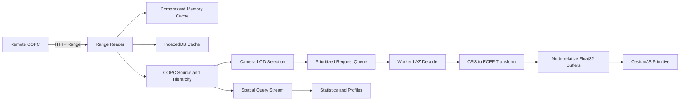

# Architecture

CesiumJS COPC Runtime separates I/O, selection, decoding, rendering, and analysis so
each layer can be tested and evolved independently.

## Runtime data flow

## Package boundaries

| Package                  | Owns                                                | Does not own           |
| ------------------------ | --------------------------------------------------- | ---------------------- |
| `cesiumjs-copc-core`     | ranges, hierarchy, decode types, persistent cache   | camera and GPU         |
| `cesiumjs-copc-runtime`  | LOD, budgets, queue, decoded LRU                    | Cesium objects         |
| `cesiumjs-copc-worker`   | Worker lifecycle, LAZ decode, render coordinates    | camera selection       |
| `cesiumjs-copc`          | Cesium lifecycle, buffers, picking, visual controls | COPC parsing internals |
| `cesiumjs-copc-analysis` | source-CRS query streams and aggregations           | visualization          |

Dependencies point inward: integration packages depend on core/runtime/worker, while
the core layer has no CesiumJS dependency.

## Streaming and LOD

COPC refinement is additive. Parent nodes remain visible while children load. A child
cohort is revealed only when enough of its required nodes are ready, preventing small
isolated high-density patches. Request priority combines screen-space error, camera
center proximity, and traversal state. Camera changes reprioritize queued work and
cancel requests that are no longer useful.

## Precision model

Source coordinates remain `Float64` for picking, filtering, and analysis. Workers
transform the normal ellipsoid-height path into ECEF and subtract a node origin before
creating `Float32` render positions. Cesium places the node through a model matrix.
This keeps GPU attributes compact without losing global-coordinate precision.

Explicit geoid correction uses a fallback transformation path because the vertical
model must be evaluated per point. The runtime never guesses a geoid model from
incomplete metadata.

## Cache layers

1. Compressed range memory cache reduces duplicate network reads.
2. Optional IndexedDB persists exact byte ranges between sessions.
3. Byte-sized decoded-node LRU limits CPU memory.
4. Visible Cesium buffers are released as nodes leave the active set.

Cache limits and point budgets are independent so applications can trade bandwidth,
decode cost, and GPU memory separately.

## Failure boundaries

URL validation fails early for missing range support or invalid COPC metadata. Worker
errors are associated with node requests, and destroyed layers reject further work.
Retry/backoff policy and richer CRS diagnostics remain tracked roadmap items.

See [ADR-0001](adr/0001-native-copc-runtime.md) for the choice of native runtime
rendering over runtime-generated 3D Tiles.
